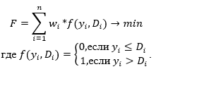

# Разработка алгоритмов решения задачи минимизации веса невыполненных заданий

## Содержательная  постановка задачи

1. Один прибор для выполнения работ
2. Порядок обслуживания произвольный
3. Все работы доступны сразу 
4. Прерывания не допускаются 
5. Длительность выполнения, вес и директивный срок каждой работы известны 

Требуется минимизировать суммарное число нарушений директивных сроков (положительную разницу между моментом окончания работ и её директивным сроком).

## Математическая модель

### Исходные параметры:

1. Пусть N = {1, 2, ..., n} – множество работ, подлежащих выполнению,
2. T = (t1, t2,…, tn) – вектор длительностей выполнений работ,
3. D = (D1, D2,…, Dn) – вектор директивных сроков,
4. W = (w1, w2,…, wn) – вектор весов.

### Варьируемые параметры:

1. X= (x1, x2 ,…, xn) – вектор моментов начала выполнения.
2. Y= (y1, y2 ,…,  yn) – вектор моментов окончания выполнения.

### Ограничения:

1. yi = xi + ti , i∈N – выполнение работы на машине производится без прерываний;
2. xj ≥ yi + ti , j>i,  i,j∈N – на машине одновременно может выполняться только одна работа;

### Критерий

## Реализованные алгоритмы решения задачи:

1. Полный перебор решений (для N < 12)
2. Жадный алгоритм
3. Алгоритм восхождения на вершину (Hill-Climbing)
4. Алгоритм имитации отжига (Simulated Annealing)

Сложность задачи 
Поставленная задача относится к классу NP-полных
[«Вычислительные машины и труднорешаемые задачи»
 М. Гэри, Д.  Джонсон,  задача ТР3].
 
 ## Hill Climbing
 
1. Задается случайное расписание. 
2. В данной реализации алгоритма окрестность решения (перестановки) находится путем смены места первой(очередной) позиции со всеми последующими в текущей перестановке.
3. После каждой транспозиции вычисляется штраф по новому расписанию. 
4. Если новый штраф меньше текущего, то перестановка становится текущей. 
5. Продолжается процесс исследования окрестности.
6. Алгоритм заканчивает работу если,  в окрестности текущего решения не найдется решения с меньшим штрафом.

## Simulated Annealing

1. В алгоритме за энергию термодинамической системы принимается значение критерия задачи с дир сроками. Перестановка, определяющая порядок выполнения работ - это состояние термодинамической системы. 
2. Алгоритм стартует со случайной перестановки, перестановки перебираются случайно и ищется та, в которой значение критерия меньше, т.е. происходит охлаждение термодинамической системы.
3. Условием остановки алгоритма является отсутствие улучшений значения критерия задачи.

## Выводы

1. В данной работе рассмотрена задача минимизации веса невыполненных заданий. 
2. Рассмотрены четыре различных подхода к решению этой задачи – полный перебор, метод восхождения на холм, имитация отжига и жадный алгоритм.
3. Реализованы процедуры получения точного и приближенного решения задачи.
4. Метод восхождения на холм находит точное решение, либо с небольшим отклонением. 
5. Жадный алгоритм не особо эффективен, т.к. показывает результаты с большим отклонением.
6. Алгоритм имитации отжига показывает хорошие результаты, работая быстрее метода восхождения на холм, но показывает чуть большие отклонения от точного результата. 

## Литература

1.	М. Гэри, Д. Джонсон Вычислительные машины и труднорешаемые задачи. М.: Мир, 1982
2.	Ф.А. Новиков Дискретная математика для программистов: Учебник для вузов. 3- е изд. – СПб.: Питер, 2009. –384 с.
3.	Липский В. Комбинаторика для программистов. – М.: Мир, 1988.
4.	Танаев В. С. Теория расписаний. – М: «Знание», 1988.
5.	Лазарев А. А., Гафаров Е. Р. Теория расписаний. Задачи и алгоритмы. – М, 2011.
6.	Пантелеев А. В. Метаэвристические алгоритмы поиска условного экстремума.

### [Результат работы можно просмотреть в папке data](data/)
